# Creare un'applicazione Azure IoT Central

Passare alla pagina [Application Manager](https://aka.ms/iotcentral) (Gestione applicazioni) di Azure IoT Central. È necessario eseguire l'accesso con un account Microsoft personale o con l'account aziendale o dell'istituto di istruzione.

Per iniziare a creare una nuova applicazione Azure IoT Central, selezionare ***Nuova applicazione***. 

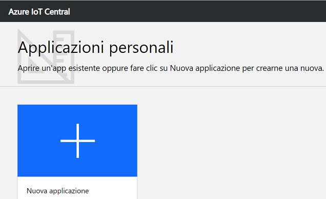

Si aprirà la pagina ***Creare un'applicazione***,.

 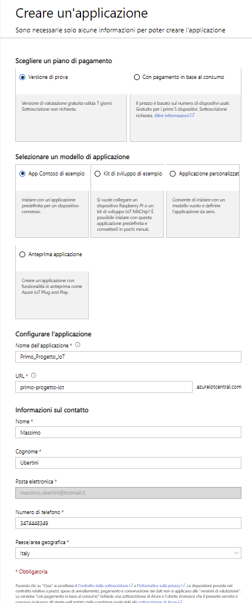

Per creare una nuova applicazione Azure IoT Central:

1. Scegliere un piano di pagamento:

   - Le applicazioni di tipo ***Versione di prova*** sono gratuite per 7 giorni prima della scadenza. Possono essere convertite in applicazioni con pagamento in base al consumo in qualsiasi momento prima della scadenza. Se si crea un'applicazione di tipo ***Versione di prova***, è necessario immettere le informazioni sul contatto e scegliere se ricevere informazioni e suggerimenti da Microsoft.
   - Le applicazioni di tipo ***Con pagamento in base al consumo*** prevedono un addebito per ogni dispositivo, con i primi 5 dispositivi offerti gratuitamente. Se si crea un'applicazione di tipo ***Con pagamento in base al consumo***, è necessario selezionare un'opzione in *Directory*, *Sottoscrizione di Azure* e *Area*:
     - *Directory* è l'istanza di Azure Active Directory (AD) in cui creare l'applicazione. Contiene le identità degli utenti, le credenziali e altre informazioni sull'organizzazione. Se non si ha un'istanza di Azure AD, ne viene creata una automaticamente quando si crea una sottoscrizione di Azure.
     - Una *sottoscrizione di Azure* consente di creare istanze dei servizi di Azure. IoT Central effettuerà il provisioning delle risorse nella sottoscrizione. Se non si ha una sottoscrizione di Azure, è possibile crearne una nella [pagina di iscrizione ad Azure](https://aka.ms/createazuresubscription). Dopo aver creato la sottoscrizione di Azure, passare alla pagina ***Crea Applicazione***. Selezionare la sottoscrizione nella casella di riepilogo a discesa ***Azure Subscription***.
     - *Area* è la posizione fisica in cui si vuole creare l'applicazione. In genere è consigliabile scegliere l'area fisicamente più vicina ai dispositivi per ottenere prestazioni ottimali. Le aree in cui Azure IoT Central è disponibile sono elencate nella pagina [Prodotti disponibili in base all'area](https://azure.microsoft.com/regions/services/). Dopo aver scelto un'area, non è possibile spostare l'applicazione in un'altra area geografica in un secondo momento.

2. Scegliere un modello di applicazione. Un modello di applicazione può contenere elementi predefiniti, ad esempio modelli di dispositivi e dashboard che facilitano le cose.

   | Modello di applicazione     | DESCRIZIONE                                                  |
   | :-------------------------- | :----------------------------------------------------------- |
   | Esempio Contoso             | Crea un'applicazione che include un modello di dispositivo già creato per un distributore automatico refrigerato. Usare questo modello per iniziare a esplorare Azure IoT Central. |
   | Esempio Devkits             | Crea un'applicazione con modelli di dispositivo pronti per la connessione a un dispositivo MXChip o Raspberry Pi. Si consiglia di usare questo modello agli sviluppatori di dispositivi che vogliono fare pratica con questi tipi di dispositivi. |
   | Applicazione personalizzata | Crea un'applicazione vuota per l'utente da popolare con i propri modelli di dispositivi e dispositivi. |

3. Immettere un nome descrittivo per l'applicazione, ad esempio *Primo_Progetto_IoT*. Azure IoT Central genera un prefisso URL univoco. È possibile modificare questo prefisso URL in modo da renderlo più facile da ricordare.

4. Fare clic su ***Crea***.

##### Usare l'UI 

- Definire i tipi di dispositivo che si connettono alla soluzione.
- Configurare le regole e le azioni per i dispositivi.
- Personalizzare l'UI per un *operatore* che usa la soluzione.

Gli *operatori* usano l'UI di Azure IoT Central per gestire la soluzione Azure IoT Central. È possibile usare l'interfaccia utente per  i motivi seguenti.

- Eseguire il monitoraggio dei dispositivi.
- Configurare i dispositivi.
- Risolvere e correggere i problemi relativi ai dispositivi.
- Eseguire il provisioning di nuovi dispositivi.

##### Usare il menu di spostamento a sinistra

Per accedere alle diverse aree dell'applicazione. È possibile espandere o comprimere la barra di spostamento selezionando.

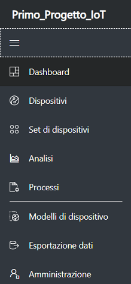

- Il pulsante ***Dashboard*** consente di accedere al dashboard dell'applicazione. I creatori possono personalizzare il dashboard per gli operatori. Anche gli utenti possono creare dashboard personalizzati.
- Il pulsante ***Dispositivi*** consente di visualizzare un elenco dei dispositivi simulati e reali associati a ogni modello di dispositivo nell'applicazione. Gli operatori usano *****Dispositivi***per gestire i dispositivi connessi.
- Il pulsante ***Set di dispositivi***  consente di visualizzare e creare set di dispositivi. Gli operatori possono creare set di dispositivi come raccolta logica di dispositivi specificati da una query.
- Il pulsante ***Analisi*** consente di visualizzare l'analisi derivata dai dati di telemetria dei dispositivi per dispositivi e set di dispositivi. Gli operatori possono creare visualizzazioni personalizzate basate sui dati dei dispositivi per derivare informazioni dettagliate dall'applicazione.
- Il pulsante ***Processi*** abilita la gestione dei dispositivi in blocco consentendo di eseguire aggiornamenti su vasta scala tramite la creazione e l'esecuzione di processi.
- Il pulsante ***Modelli di dispositivo*** visualizza gli strumenti usati da un generatore per creare e gestire i modelli di dispositivo.
- Il pulsante ***Esportazione dati*** consente ad un amministratore di configurare un'esportazione continua in altri servizi di Azure, come archiviazione e code.
- Il pulsante ***Amministrazione*** consente di visualizzare le pagine di amministrazione dell'applicazione in cui un amministratore può gestire impostazioni, utenti e ruoli.

##### Ricerca, guida e supporto tecnico

Il menu superiore è visualizzato in ogni pagina nell'angolo superiore a destra.

Per cercare modelli di dispositivo e dispositivi, immettere un valore in ***Cerca***.
Per cambiare la lingua o il tema dell'UI, scegliere l'icona ***Impostazioni***.
Per disconnettersi dall'applicazione, scegliere l'icona ***Account***.
Per accedere alla guida e al supporto tecnico, fare clic sul menu a discesa ***? Guida***  per visualizzare un elenco di risorse. 
È possibile scegliere tra un tema scuro o un tema chiaro per l'UI.

##### Dashboard

Il dashboard è la prima pagina visualizzata quando si accede all'applicazione Azure IoT Central. I creatori possono personalizzare il dashboard dell'applicazione per altri utenti aggiungendo riquadri. Per altre informazioni, vedere l'esercitazione sulla [personalizzazione della visualizzazione operatore di Azure IoT Central](https://docs.microsoft.com/it-it/azure/iot-central/tutorial-customize-operator).

Gli operatori possono creare dashboard personalizzati e spostarsi tra di essi e il dashboard predefinito. Per altre informazioni, vedere [Creare e gestire i dashboard personali](https://docs.microsoft.com/it-it/azure/iot-central/howto-personalize-dashboard).

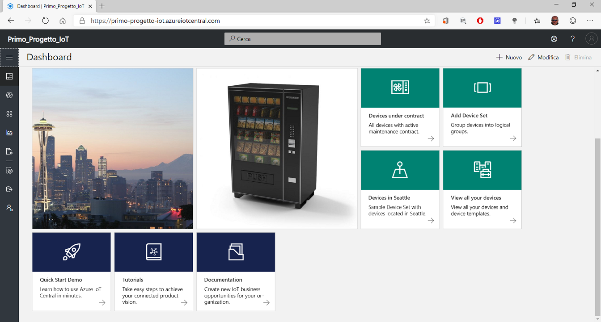

##### Dispositivi

La pagina visualizza i ***Dispositivi*** presenti nell'applicazione Azure IoT Central raggruppati per *modello di dispositivo*.

- Un modello di dispositivo consente di definire un tipo di dispositivo in grado di connettersi all'applicazione. Per altre informazioni, vedere l'esercitazione sulla [definizione di un nuovo tipo di dispositivo nell'applicazione Azure IoT Central](https://docs.microsoft.com/it-it/azure/iot-central/tutorial-define-device-type).
- Per dispositivo s'intende un dispositivo simulato o reale presente nell'applicazione. 

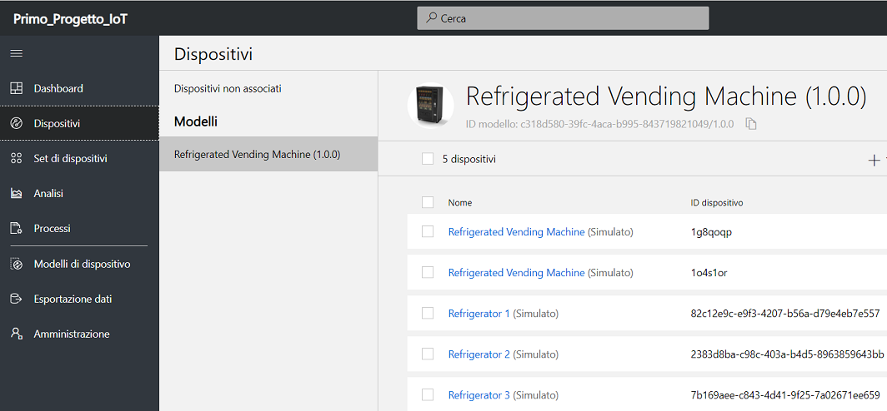

##### Set di dispositivi

Visualizza i set di dispositivi creati dal generatore. Per set di dispositivi s'intende una raccolta di dispositivi correlati. I generatori definiscono una query per identificare i dispositivi inclusi in un set di dispositivi. I set di dispositivi sono usati durante la personalizzazione dell'analisi nell'applicazione. Per altre informazioni, vedere l'articolo sull'[uso di set di dispositivi nell'applicazione Azure IoT Central](https://docs.microsoft.com/it-it/azure/iot-central/howto-use-device-sets).

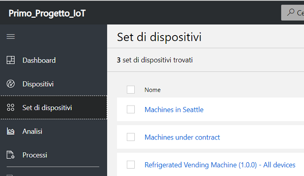

##### Analisi

Visualizza grafici che consentono di comprendere il comportamento dei dispositivi connessi all'applicazione. Gli operatori usano questa pagina per controllare e analizzare i problemi relativi ai dispositivi connessi. I generatori possono definire i grafici visualizzati in questa pagina. Per altre informazioni, vedere l'articolo sulla [creazione di analisi personalizzate per l'applicazione Azure IoT Central](https://docs.microsoft.com/it-it/azure/iot-central/howto-use-device-sets).

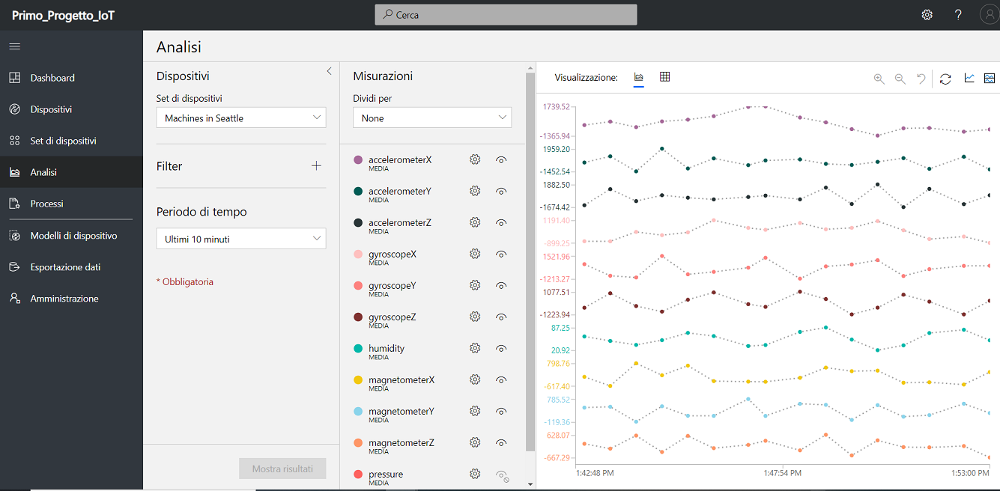

##### Processi

Consente di eseguire operazioni di gestione dei dispositivi in blocco nei propri dispositivi. Il generatore usa questa pagina per aggiornare le proprietà, le impostazioni e i comandi del dispositivo. Per altre informazioni, vedere l'articolo [Eseguire un processo](https://docs.microsoft.com/it-it/azure/iot-central/howto-run-a-job).

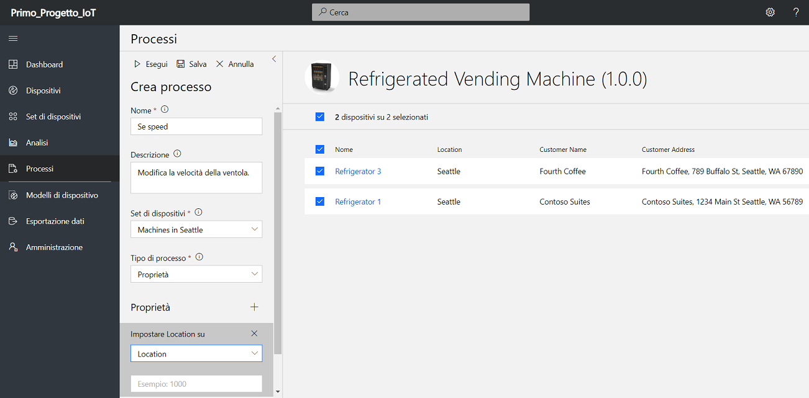

##### Modelli di dispositivo

Consente ad un generatore di creare e gestire i modelli di dispositivo nell'applicazione. Un modello di dispositivo specifica le caratteristiche del dispositivo.

- Dati di telemetria, stato e misure di evento.
- Impostazioni e proprietà.
- Comandi.
- Regole basate su eventi o valori di telemetria.

Per altre informazioni, vedere l'esercitazione sulla [definizione di un nuovo tipo di dispositivo nell'applicazione Azure IoT Central](https://docs.microsoft.com/it-it/azure/iot-central/tutorial-define-device-type).

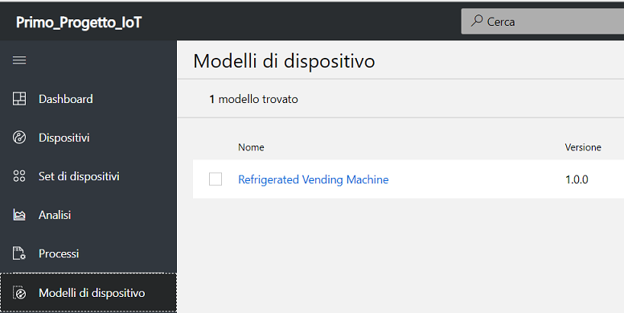

###### Aggiungere un modello di dispositivo

La procedura seguente mostra come creare un nuovo modello di dispositivo ***Condizionatore connesso*** per i dispositivi che inviano all'applicazione dati di telemetria sulla temperatura.

1. Nella pagina ***Modelli di dispositivo***, selezionare ***+ Nuovo***.

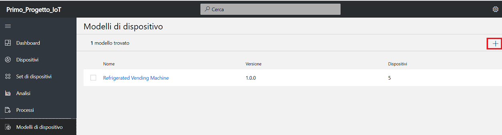

2. La pagina visualizza i modelli che è possibile scegliere.

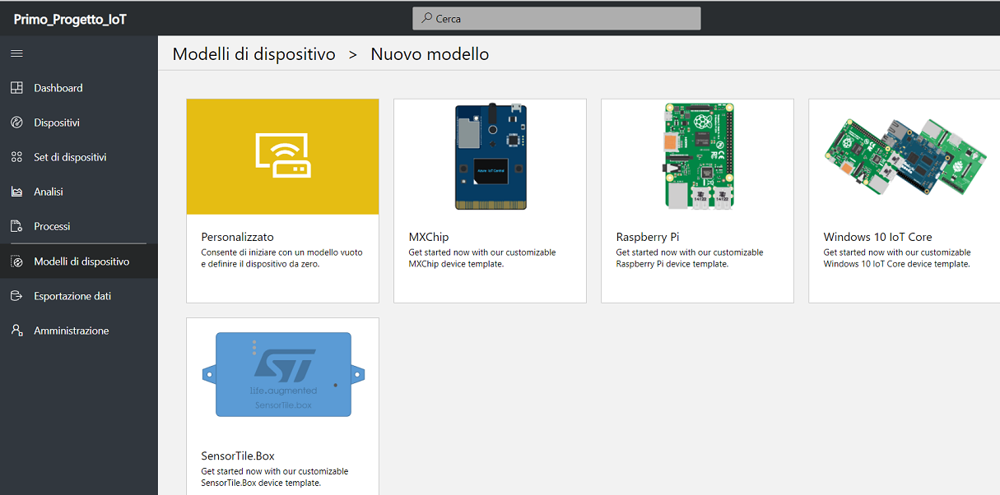

3. Selezionare ***Personalizzato***, immettere ***Condizionatore connesso*** come nome del modello di dispositivo e quindi selezionare ***Crea***. 

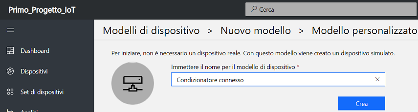

4. Nel modello di dispositivo ***Condizionatore connesso***, assicurarsi di trovarsi nella scheda ***Misure*** dove si definiscono i dati di telemetria. Ogni modello di dispositivo che è definito dispone di schede separate in cui è possibile:

- Specificare le *misure*, ad esempio dati di telemetria, evento e stato, inviate dal dispositivo.
- Definire le *impostazioni* usate per controllare il dispositivo.
- Definire le *proprietà* che sono i metadati del dispositivo.
- Definire i *comandi* da eseguire direttamente nel dispositivo.
- Definire le *regole* associate al dispositivo.
- Personalizzare il *dashboard* del dispositivo per gli operatori.

5. Per aggiungere la misurazione dei dati di telemetria della temperatura, selezionare ***+ Nuova misurazione***. Quindi scegliere ***Telemetria*** come tipo di misura.

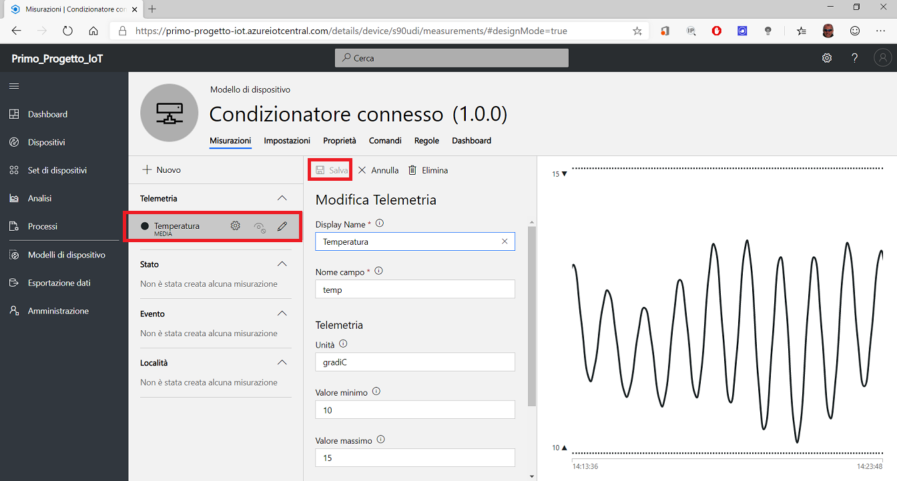

Ogni tipo di dati di telemetria definito per un modello di dispositivo include [opzioni di configurazione](https://docs.microsoft.com/it-it/azure/iot-central/howto-set-up-template).

- Opzioni di visualizzazione.
- Dettagli dei dati di telemetria.
- Parametri di simulazione.

È anche possibile scegliere un colore per la visualizzazione dei dati di telemetria. Per salvare la definizione dei dati di telemetria, selezionare ***Salva***.

7. Dopo un breve periodo di tempo, la scheda ***Misure*** mostra un grafico dei dati di telemetria sulla temperatura dal condizionatore connesso simulato. Usare i controlli per gestire la visibilità e l'aggregazione o per modificare la definizione dei dati di telemetria.

8. È anche possibile personalizzare il grafico usando i controlli ***Riga***, ***In pila*** e ***Modifica intervallo di tempo***.

###### Aggiungere una misura di evento

Usare gli eventi per definire dati temporizzati che il dispositivo invia quando si verifica un evento come un errore o il guasto di un componente. Azure IoT Central consente di simulare eventi di dispositivo che permettono di testare il comportamento dell'applicazione prima di collegare un dispositivo reale. Definire le misurazioni di evento per il modello di dispositivo nella vista ***Misure***.

1. Per aggiungere la misurazione dell'evento ***Errore motore ventola*** selezionare ***+ Nuova misurazione***. Quindi scegliere ***Evento*** come tipo di misura.

2. Ogni tipo di evento definito per un modello di dispositivo include [opzioni di configurazione](https://docs.microsoft.com/it-it/azure/iot-central/howto-set-up-template).

- Nome visualizzato.
- Nome campo.
- Gravità.

Per salvare la definizione dell'evento, selezionare ***Salva***.

Dopo un breve periodo di tempo, la scheda ***Misure*** mostra un grafico degli eventi generato casualmente dal condizionatore connesso simulato. Usare i controlli per gestire la visibilità o per modificare la definizione dell'evento.

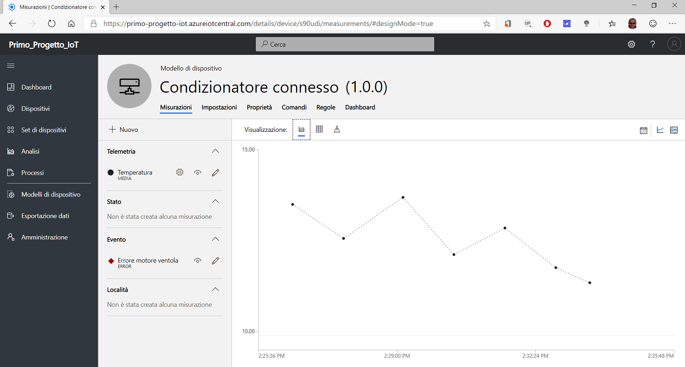

###### Definire una misura di stato

È possibile usare lo stato per definire e visualizzare lo stato del dispositivo o del suo componente in un periodo di tempo. Azure IoT Central può simulare lo stato del dispositivo per permettere di testare il comportamento dell'applicazione prima di collegare un dispositivo reale. Si definiscono le misurazioni di stato per il tipo di dispositivo nella vista ***Misure***.

1. Per aggiungere una misurazione di stato ***Modalità ventola***, fare clic su ***+ Nuova misurazione***. Quindi scegliere ***Stato*** come tipo di misura:

2. Ogni tipo di stato definito per un modello di dispositivo include [opzioni di configurazione](https://docs.microsoft.com/it-it/azure/iot-central/howto-set-up-template).

- Nome visualizzato.
- Nome campo.
- Valori con etichette di visualizzazione facoltative.
- Colore per ogni valore.

3. Dopo un breve periodo di tempo, la scheda ***Misure*** mostra un grafico degli stati generato casualmente dal condizionatore connesso simulato. Usare i controlli per gestire la visibilità o per modificare la definizione dello stato.
4. Se sono presenti troppi punti dati inviati dal dispositivo in un periodo limitato, la misura stato è visualizzata con un oggetto visivo diverso. Selezionare il grafico per visualizzare tutti i punti dati all'interno di tale periodo di tempo in ordine cronologico. È anche possibile restringere l'intervallo di tempo per visualizzare la misura più in dettaglio.
5. Selezionare ***Salva***.

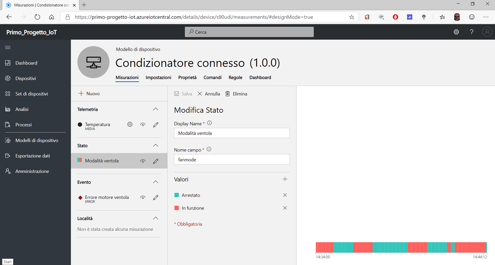

##### Esportazione dati

Consente ad un amministratore di definire come eseguire lo streaming dei dati, ad esempio di telemetria, dall'applicazione. I dati esportati possono essere archiviati in altri servizi o usati per l'analisi. Per altre informazioni, vedere l'articolo [Esportare i dati in Azure IoT Central](https://docs.microsoft.com/it-it/azure/iot-central/howto-export-data).

##### Amministrazione

Contiene i collegamenti agli strumenti usati da un amministratore, ad esempio per definire utenti e ruoli nell'applicazione e personalizzare l'UI. Per altre informazioni, vedere l'articolo sull'[amministrazione dell'applicazione Azure IoT Central](https://docs.microsoft.com/it-it/azure/iot-central/howto-administer).

## Impostazioni, proprietà, e comandi 

Sono valori diversi definiti in un modello di dispositivo e associati a ogni singolo dispositivo.

- Le *impostazioni* sono usate per inviare dati di configurazione dall'applicazione ad un dispositivo. Ad esempio, un operatore può usare un'impostazione per modificare l'intervallo dei dati di telemetria di un dispositivo da 2 secondi a 5 secondi. Quando un operatore modifica un'impostazione, questa è contrassegnata come in sospeso nell'UI finché il dispositivo risponde con un riconoscimento.
- Le *proprietà* sono usate per definire i metadati associati al dispositivo. Sono disponibili due categorie di proprietà.
  1. Le *proprietà dell'applicazione* sono usate per registrare informazioni sul dispositivo nell'applicazione. È ad esempio possibile usare le proprietà dell'applicazione per registrare la posizione di un dispositivo e la data dell'ultimo utilizzo. Queste proprietà sono archiviate nell'applicazione e non sono sincronizzate con il dispositivo. Un operatore può assegnare valori alle proprietà.
  2. Le *proprietà dispositivo* sono usate per permettere ad un dispositivo d'inviare valori di proprietà all'applicazione. Queste proprietà possono essere modificate solo dal dispositivo. Per un operatore, le proprietà dispositivo sono di sola lettura. In questo scenario relativo a un condizionatore connesso, il numero di serie del dispositivo e la versione del firmware sono proprietà del dispositivo segnalate dal dispositivo.
- I *comandi* si usano per gestire il dispositivo in modalità remota dall'applicazione. È possibile eseguire i comandi direttamente sul dispositivo dal cloud per controllare i dispositivi. Un operatore, ad esempio, può eseguire un comando come un riavvio, per riavviare immediatamente il dispositivo.

###### Impostazioni

Sono usate per permettere ad un operatore d'inviare dati di configurazione ad un dispositivo. Aggiungere un'impostazione al modello di dispositivo ***Condizionatore connesso*** che consente ad un operatore d'impostare la temperatura di destinazione del condizionatore.

1. Passare alla scheda ***Impostazioni*** per il modello di dispositivo ***Condizionatore connesso***.
2. È possibile creare impostazioni di tipi diversi, ad esempio numeri o testo. Selezionare ***Numero*** per aggiungere un'impostazione numerica al dispositivo.

Quando il dispositivo conferma una modifica dell'impostazione, l'impostazione passa allo stato ***sincronizzato***.

4. È possibile personalizzare il layout della scheda ***Impostazioni*** spostando e ridimensionando i riquadri delle impostazioni.
5. Selezionare ***Salva***.

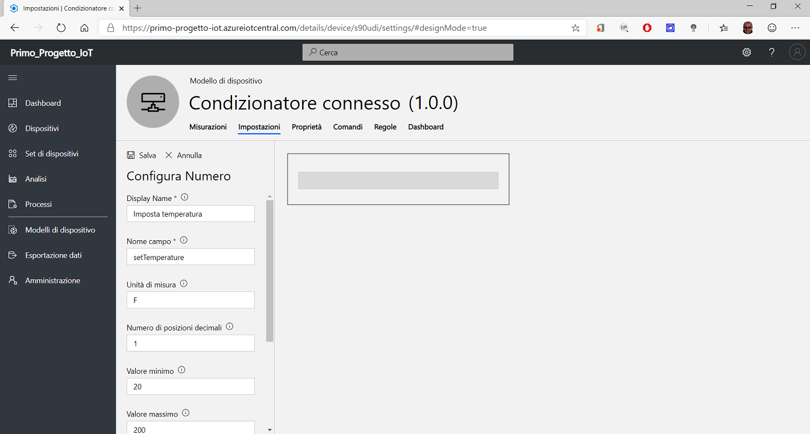

###### Proprietà

Sono usate per archiviare informazioni sul dispositivo nell'applicazione. Si aggiungono le proprietà dell'applicazione al modello di dispositivo ***Condizionatore connesso*** per archiviare la posizione del dispositivo e la data dell'ultimo utilizzo. Queste proprietà sono modificabili nell'applicazione. Il dispositivo segnala anche proprietà quali il numero di serie e la versione del firmware che sono di sola lettura nell'applicazione.

1. Passare alla scheda ***Proprietà*** per il modello di dispositivo ***Condizionatore connesso***.
2. Per aggiungere una proprietà relativa alla data dell'ultimo utilizzo al modello di dispositivo, scegliere ***Data***.
3. Selezionare ***Salva***.

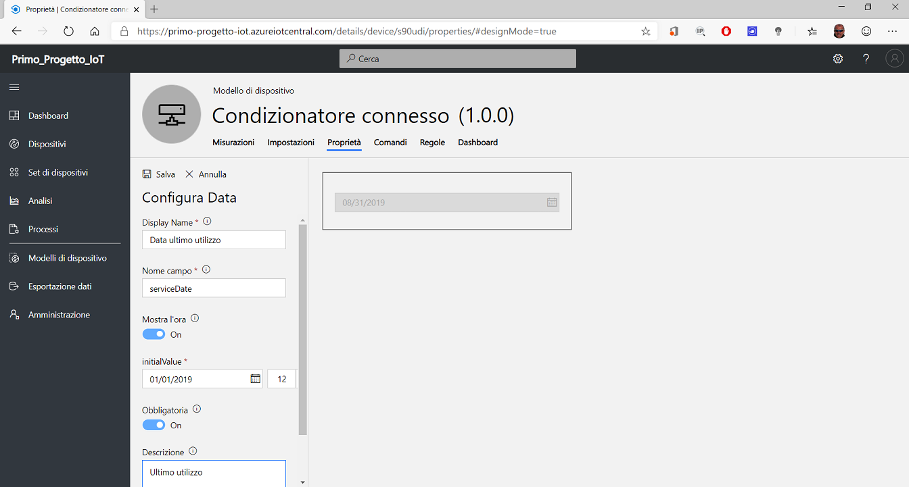

1. È possibile personalizzare il layout della scheda ***Proprietà*** spostando e ridimensionando i riquadri delle proprietà.
2. Per aggiungere una proprietà del dispositivo, ad esempio la versione del firmware, al modello di dispositivo, scegliere ***Proprietà del dispositivo***.
3. Selezionare ***Salva***.

La proprietà del dispositivo è inviata dal dispositivo all'applicazione. I valori della versione del firmware e del numero di serie saranno aggiornati quando il dispositivo reale si connetterà ad IoT Central.

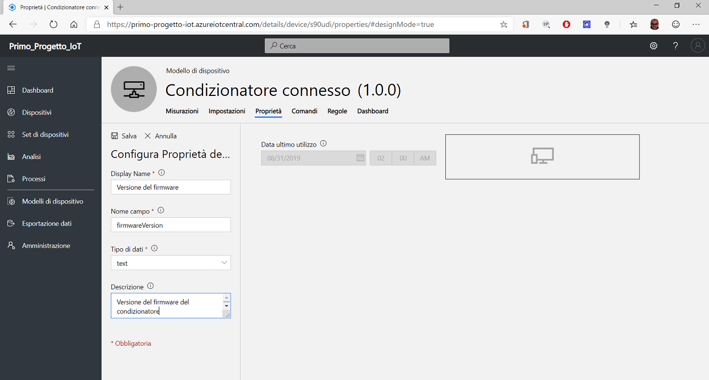

###### Comandi

Si usano per consentire ad un operatore di eseguire i comandi direttamente sul dispositivo. Aggiungere un comando al modello di dispositivo ***Condizionatore connesso*** che consente ad un operatore di ripetere un determinato messaggio sul display del condizionatore connesso.

1. Passare alla scheda ***Comandi*** per il modello di dispositivo ***Condizionatore connesso*** per modificare il modello.
2. Selezionare ***+ Nuovo comando*** per aggiungere un comando al dispositivo e iniziare a configurare il nuovo comando.
3. Selezionare ***Salva***.

## Visualizzare il dispositivo simulato

Dopo aver definito il modello di dispositivo ***Condizionatore connesso***, è possibile personalizzare il relativo ***Dashboard*** per includere le misure, le impostazioni e le proprietà definite. È quindi possibile visualizzare in anteprima il dashboard come un operatore.

1. Scegliere la scheda ***Dashboard*** per il modello di dispositivo ***Condizionatore connesso***.
2. Fare clic su ***Grafico a linee*** per aggiungere il componente al ***Dashboard***.
3. Selezionare ***Salva***.

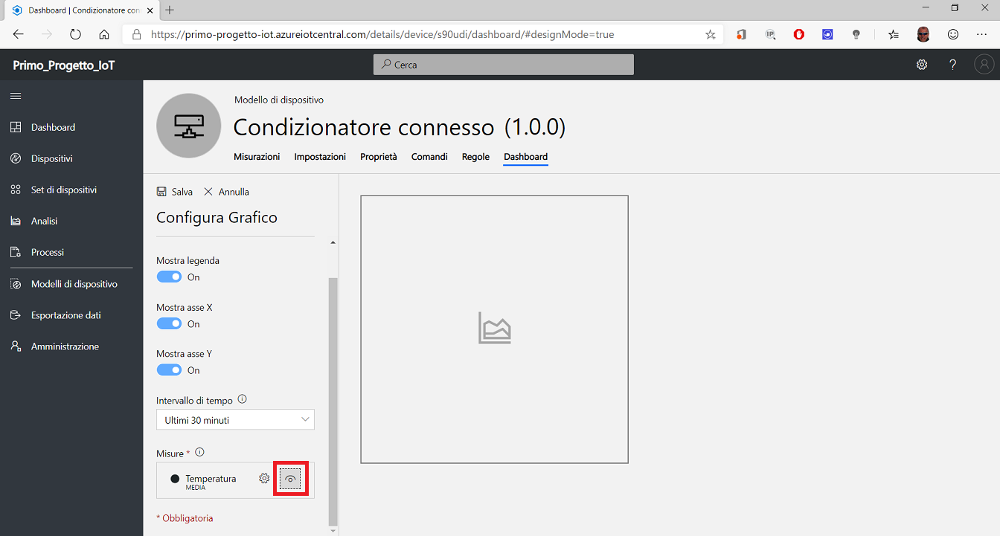

4. Selezionare il componente ***Cronologia eventi***.
5. Selezionare ***Salva***.

È ora possibile vedere i dati simulati per il Condizionatore connesso nel dashboard. È possibile modificare i riquadri e il layout per il dashboard.

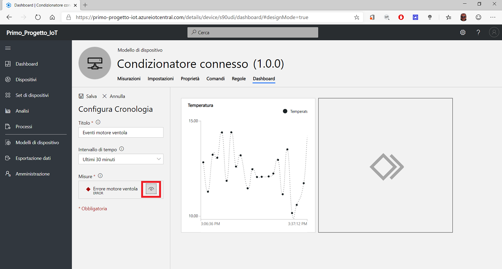

###### Regole

Creare una regola che invia un messaggio di posta elettronica quando la temperatura di un condizionatore connesso supera 90° F (circa 32° C).

1. Passare alla scheda ***Regole*** per il modello di dispositivo ***Condizionatore connesso*** per modificare il modello.
2. Selezionare ***+ Nuovo*** per aggiungere una  regola al dispositivo e iniziare a configurare la nuova regola e ***Telemetria***.
3. Selezionare ***Salva***.

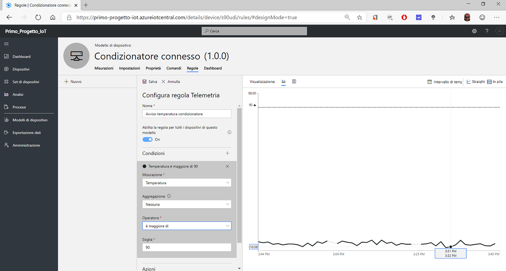

###### Azione

Quando si definisce una regola è anche possibile definire un'azione da eseguire quando sono soddisfatte le condizioni della regola. Creare una regola con un'azione che invia una notifica tramite posta elettronica.

1. Per aggiungere un'**azione**, salvare prima la regola e quindi scorrere verso il basso nel pannello ***Configura regola Telemetria*** . Scegliere ***+ Azioni*** e quindi scegliere ***Posta elettronica***.
2. Selezionare ***Salva***.

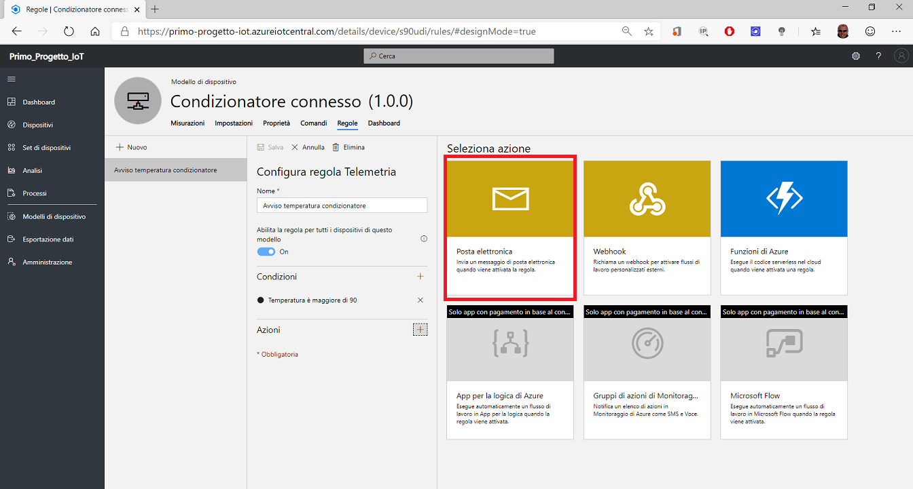

Per ricevere una notifica, l'indirizzo di posta elettronica deve essere un [ID utente nell'applicazione](https://docs.microsoft.com/it-it/azure/iot-central/howto-administer) e tale utente deve aver eseguito almeno una volta l'accesso all'applicazione.

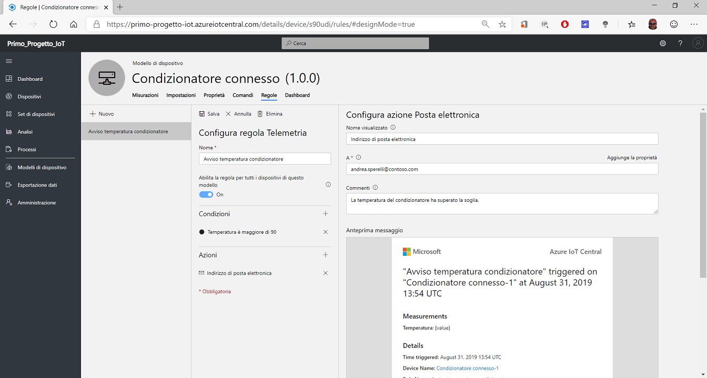

Subito dopo aver salvato la regola, questa è applicata. Quando sono soddisfatte le condizioni definite nella regola, l'applicazione invia un messaggio all'indirizzo di posta elettronica specificato nell'azione.