# Creare un'app UWP C# in Visual Studio

In questa introduzione all'**IDE** (*Integrated Development Environment)* di Visual Studio sarà creata una semplice app "Primo_progetto_IoT". A tale scopo, saranno usati un modello di progetto della piattaforma **UWP** (*Universal Windows Platform*), **XAML** (*Extensible Application Markup Language*)  e il linguaggio di programmazione C#.

Se Visual Studio non è ancora installato, accedere alla pagina [Download di Visual Studio](https://visualstudio.microsoft.com/downloads/?utm_medium=microsoft&utm_source=docs.microsoft.com&utm_campaign=inline+link&utm_content=download+vs2019) per installarlo gratuitamente.


## Creare una soluzione

Per prima cosa è necessario creare un progetto della piattaforma UWP. Il tipo di progetto include fin dall'inizio tutti i file di modello necessari.

Per prima cosa, si creerà un progetto di app C#. Il tipo di progetto include fin dall'inizio tutti i file modello necessari.

1. Aprire Visual Studio 2019.
2. Nella finestra iniziale scegliere ***Crea un nuovo progetto***.
3. Nella finestra ***Crea un nuovo progetto*** immettere o digitare *Windows universale* nella casella di ricerca. Scegliere quindi **C# **  dall'elenco ***Linguaggio*** e ***Windows*** dall'elenco ***Piattaforma***.

Dopo aver applicato i filtri di linguaggio e piattaforma, scegliere il modello ***App vuota (Windows universale)*** e quindi scegliere ***Avanti***.


 Se il modello ***App vuota (Windows universale)*** non è visualizzato, è possibile installarlo dalla finestra ***Crea un nuovo progetto***. Nel messaggio ***L'elemento cercato non è stato trovato?*** scegliere il collegamento ***Installa altri strumenti e funzionalità***.

 Scegliere quindi il carico di lavoro ***Sviluppo di app per la piattaforma UWP (Universal Windows Platform)*** nel programma d'installazione di Visual Studio.

Scegliere quindi il pulsante ***Modifica*** nel programma d'installazione di Visual Studio. Quando è richiesto, salvare il lavoro. Scegliere quindi ***Continua*** per installare il carico di lavoro. 

4. Nella finestra di dialogo ***Nuovo progetto della piattaforma UWP (Universal Windows Platform)*** accettare le impostazioni predefinite per ***Versione di destinazione***: e ***Versione minima***:.


5. Nella finestra ***Configura il nuovo progetto*** digitare o immettere *Primo_Progetto_UWP* nella casella ***Nome del progetto***. Scegliere ***Crea***.

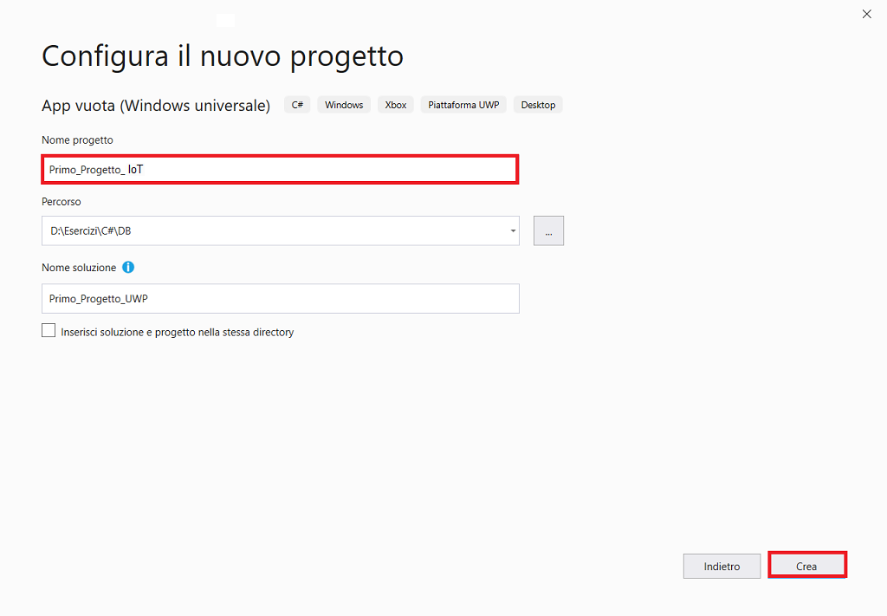

Se è la prima volta che si usa Visual Studio per creare app UWP, è possibile che sia visualizzata la finestra di dialogo ***Impostazioni***. Scegliere ***Modalità sviluppatore*** e ***S*ì**.


Visual Studio installa un pacchetto aggiuntivo di modalità sviluppatore per l'utente. Una volta completata l'installazione del pacchetto, chiudere la finestra di dialogo ***Impostazioni***.


## Creare l'app

Lo sviluppo delle app per Windows 10 IoT Core segue il normale sviluppo di app UWP e la distribuzione avviene via rete perché il **SO** (*Sistema Operativo*) include **RDM** (*Remote Debugging Monitor*).

 [Progetti comuni]( https://microsoft.hackster.io/en-US).


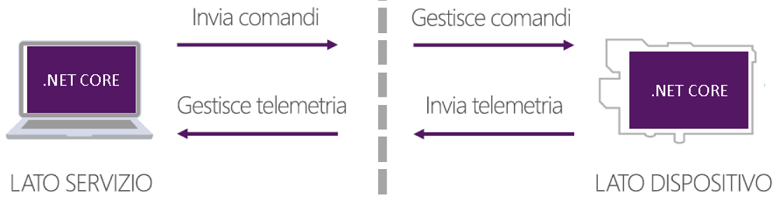

### RaspberryPI, MinnowBoard e [Windows 10 IoT Core](https://developer.microsoft.com/en-us/windows/iot)

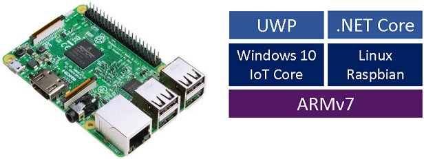

### Controllo di un dispositivo IoT locale

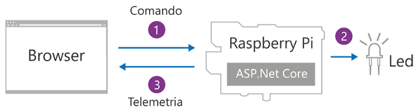

### Controllo di un dispositivo IoT remoto

[Azure IoT Hub](https://www.azureiotsolutions.com/Accelerators) .

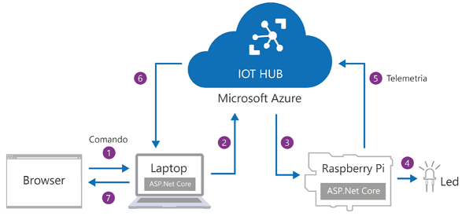

**Windows 10 Extensions SDK**

Permettono di accedere alle funzionalità d’I/O delle schede, in pratica è possibile interagire con i loro pin.

 **L’astrazione fornita da queste estensioni è tale che lo stesso codice può funzionare su tutte le schede che eseguono Windows 10 IoT Core, indipendentemente dalle specifiche H/W.**

 Fare clic destro su ***Riferimenti/Aggiungi riferimento...*** e nella finestra che si apre selezionare  ***Windows  IoT Extensions for the UWP***.

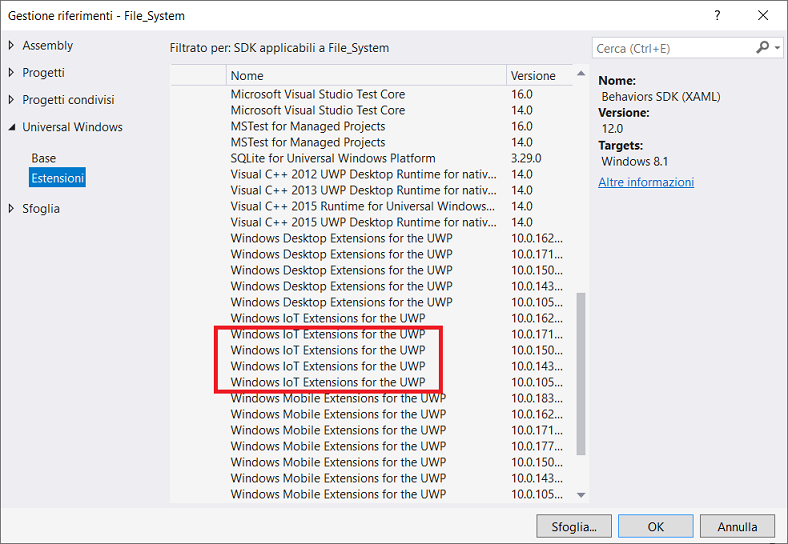

Progettare un’app che fa lampeggiare un LED tramite un pulsante.

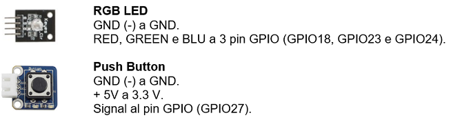

Il pulsante è un circuito, per cui premendolo si verifica un cambiamento di stato: il circuito si apre o si chiude, in pratica passa da High a Low ed viceversa.

Siccome sono dispositivi meccanici, possono aprire e chiudere i contatti molte volte durante la stessa pressione.

Per ogni modulo è necessario impostare un debounce timeout diverso, spesso è necessario procedere per tentativi anche se, in generale, 50 ms è un valore accettabile.

Al programmatore interessa sapere quando si verificano questi cambiamenti.

L’uso dei sensori è programmazione di “basso livello”.

In ***Esplora soluzioni*** si ha la seguente soluzione.

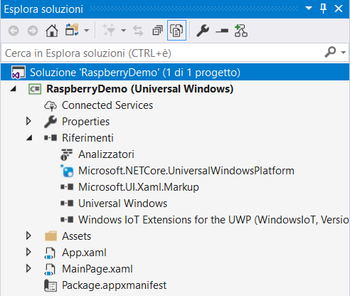

File MainPage.xaml

```xaml
<Page
    x:Class="RaspberryDemo.MainPage"
    xmlns="http://schemas.microsoft.com/winfx/2006/xaml/presentation"
    xmlns:x="http://schemas.microsoft.com/winfx/2006/xaml"
    xmlns:local="using:RaspberryDemo"
    xmlns:d="http://schemas.microsoft.com/expression/blend/2008"
    xmlns:mc="http://schemas.openxmlformats.org/markup-compatibility/2006"
    mc:Ignorable="d">
    <Grid Background="{ThemeResource ApplicationPageBackgroundThemeBrush}">
    </Grid>
</Page>
```

File MainPage.xaml.cs

```csharp
using System;
using System.Diagnostics;
using Windows.Devices.Gpio;
using Windows.UI.Xaml;
using Windows.UI.Xaml.Controls;

namespace RaspberryDemo
{
    public sealed partial class MainPage : Page
    {
        public MainPage()
        {
            this.InitializeComponent();
            this.InitLed();
            this.InitButton();
        }

        private GpioPin redPin;
        private GpioPin greenPin;
        private GpioPin bluePin;
        private GpioPin buttonPin;

        // timer per accendere e spegnere il LED
        private bool isOn;

        /* in un'app, l'evento clic si scatena quando si preme il pulsante;
           in quest'app il pulsante è H/W, in altre parole un modulo GPIO che
           può comunicare solo con valori binari, quindi si devono interpretare
           questi valori binari per capire quando il pulsante è premuto  */

        private void InitButton()
        {   // recupera il riferimento al controller GPIO
            var gpio = GpioController.GetDefault();
            // apre il pin del pulsante numero 27
            buttonPin = gpio.OpenPin(27);
            // si devono leggere dei valori, quindi è un pin d'input
            buttonPin.SetDriveMode(GpioPinDriveMode.Input);
            /* imposta l'intervallo di tempo per cui filtrare i cambi di stato
               si valorizza la proprietà DebounceTimeout, in pratica il tempo
               per cui i cambiamenti del valore del pin sono filtrati, quindi non
               si generano eventi ValueChanged; nell'esempio sono 50 ms
               così da evitare eventi spuri  causati da disturbi elettrici  */
            buttonPin.DebounceTimeout = TimeSpan.FromMilliseconds(50);
            /* si registra sull'evento ValueChanged che è generato quando
               lo stato del pin cambia da High a Low e viceversa */
            buttonPin.ValueChanged += (s, e) =>
            {   // lettura del pin
                var value = buttonPin.Read();
                /* stampa il valore nella finestra di Output
                   pulsante premuto = valore stampato: Low
                   pulsante rilasciato = valore stampato: High */
                Debug.WriteLine(value);
                if (value == GpioPinValue.High)
                {
                    // pulsante premuto
                    if (!isOn)
                    {
                        // scrive High sul pin per accendere il LED
                        redPin.Write(GpioPinValue.High);
                        isOn = true;
                    }
                    else
                    {
                        // scrive Low sul pin per spegnere il LED
                        redPin.Write(GpioPinValue.Low);
                        isOn = false;
                    }
                }
            };
        }

        private void InitLed()
        {   // recupera il riferimento al controller GPIO
            var gpio = GpioController.GetDefault();
            // apre i 3 pin
            redPin = gpio.OpenPin(18);
            greenPin = gpio.OpenPin(23);
            bluePin = gpio.OpenPin(24);
            // scrive Low sui 3 pin
            redPin.Write(GpioPinValue.Low);
            greenPin.Write(GpioPinValue.Low);
            bluePin.Write(GpioPinValue.Low);
            // sono pin di output
            redPin.SetDriveMode(GpioPinDriveMode.Output);
            greenPin.SetDriveMode(GpioPinDriveMode.Output);
            bluePin.SetDriveMode(GpioPinDriveMode.Output);
            var timer = new DispatcherTimer();
            timer.Interval = TimeSpan.FromSeconds(0.5);
            // l’evento Tick del DispatcherTimer verifica il valore della variabile isOn
            timer.Tick += (s, e) =>
            {
                if (!isOn)
                {
                    // se è false si alza il pin RED
                    redPin.Write(GpioPinValue.High);
                    isOn = true;
                }
                else
                {
                    // se è true si abbassa il pin RED
                    redPin.Write(GpioPinValue.Low);
                    isOn = false;
                }
            };
            timer.Start();
        }
    }
}
```

## Esecuzione dell'app

Per eseguire l’app, fare clic su ***Progetto/Proprietà di…***, nella finestra che si apre selezionare la scheda ***Compilazione/Piattaforma di destinazione: ARM***, quindi selezionare la scheda ***Debug/Dispositivo di destinazione: Computer remoto*** e in ***Debug/Computer remoto***: inserire l’indirizzo IP della scheda oppure il suo nome, quello di default è **minwinpc**; eliminare il segno di spunta su ***Usa autenticazione***.

Per conoscere l’indirizzo IP della scheda, si usa l’app WINDOWSIOTCOREWATCHER che visualizza l’elenco delle schede nella LAN.

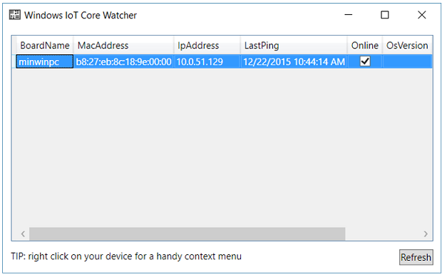

Per gestire il Raspberry con il browser, inserire l’indirizzo IP seguito dal numero di porta 8080 e le seguenti credenziali.

Login:           administrator.

Password:    p@ssw0rd.

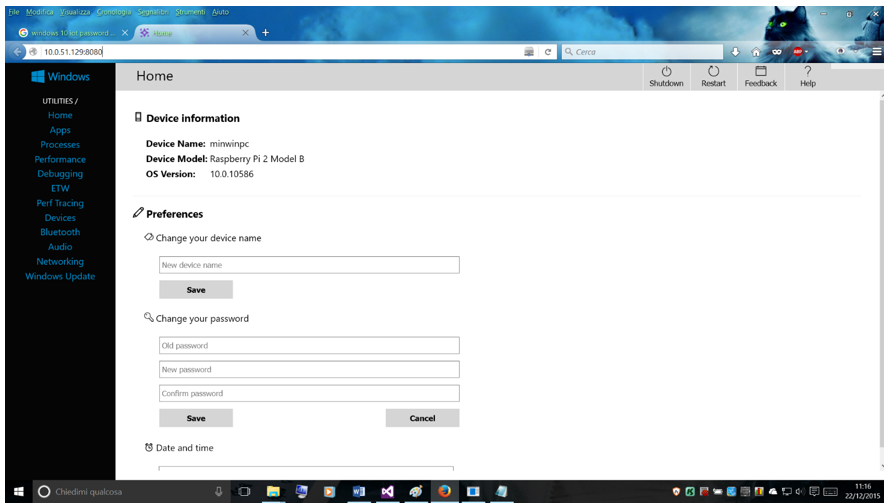

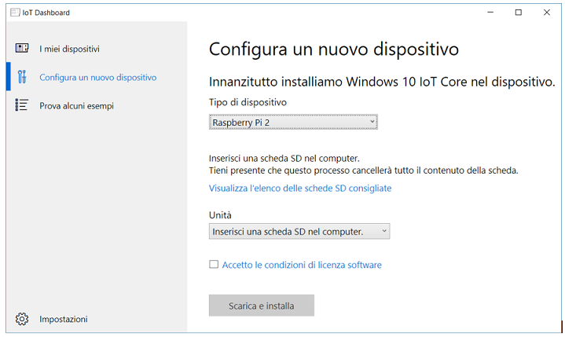

 A questo punto è possibile compilare, distribuire e avviare l'app UWP "Primo_Progetto_IoT" per verificarne l'aspetto. 

1. Usare il pulsante di riproduzione (include il testo **Computer remoto**) per avviare l'app nel PC locale.

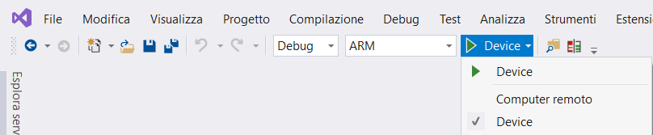

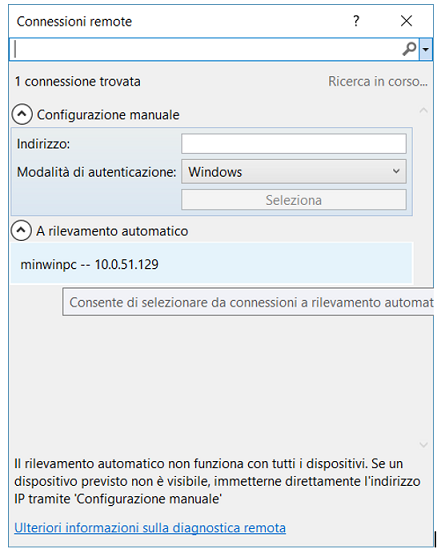


